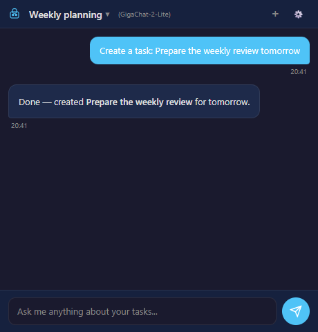
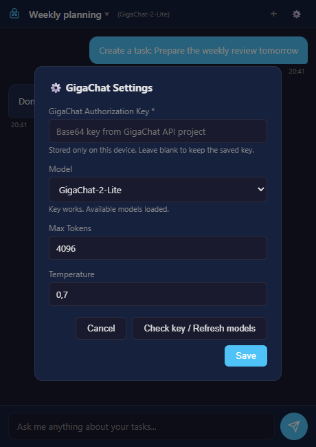

# GigaChat Assistant для Super Productivity

**Плагин с GigaChat API для управления задачами в [Super Productivity](https://super-productivity.com/).** Пишите запросы обычным языком: ассистент может создавать и изменять задачи, работать с проектами и тегами, планировать день и показывать отчёты по времени. Работает в **настольной версии** Super Productivity с личным ключом GigaChat API (`GIGACHAT_API_PERS`).

*GigaChat AI assistant plugin for Super Productivity desktop. Manage tasks, projects and tags through natural-language chat using a personal GigaChat API key.*

[**Скачать последнюю версию**](https://github.com/Driseri/ai-gigachat-plugin/releases/latest) · [Сообщить о проблеме](https://github.com/Driseri/ai-gigachat-plugin/issues) · [Документация GigaChat API](https://developers.sber.ru/docs/ru/gigachat/api/main)



*Демонстрация интерфейса с вымышленной задачей; реальные данные и ключи не использовались.*

## Установка

1. Установите [Super Productivity для компьютера](https://super-productivity.com/) версии **18.13.1 или новее**. Android- и web-версии не поддерживаются: им недоступен необходимый `nodeExecution`.
2. Создайте личный проект GigaChat API и скопируйте **Authorization Key** по [инструкции для физических лиц](https://developers.sber.ru/docs/ru/gigachat/individuals-quickstart). Плагин использует `GIGACHAT_API_PERS`; ключи `B2B` и `CORP` не поддерживаются.
3. Скачайте `gigachat-assistant-plugin.zip` из [последнего релиза](https://github.com/Driseri/ai-gigachat-plugin/releases/latest). В Super Productivity откройте **Settings → Plugins → Choose Plugin File** и выберите ZIP.
4. Включите плагин и разрешите `nodeExecution` в запросе приложения. Это разрешение даёт плагину доступ к выполнению Node.js-кода на компьютере; [проверьте исходный код и модель доверия](https://github.com/super-productivity/super-productivity/blob/master/docs/plugin-development.md) перед установкой.
5. Откройте панель плагина, нажмите **⚙️**, вставьте Authorization Key и дождитесь проверки. Плагин загрузит доступные чат-модели; выберите нужную и нажмите **Save**. Кнопка **Check key / Refresh models** позволяет повторить проверку.



*Демонстрационный список моделей; фактический список зависит от вашего доступа GigaChat.*

## Возможности

- Создание, поиск, изменение, завершение и удаление задач, включая массовые операции и подзадачи.
- Работа с проектами и тегами, перемещение и упорядочивание задач.
- Планирование задач на сегодня, управление таймером и отчёты по времени.
- Выполнение функций GigaChat с проверкой аргументов перед изменением данных (до 10 вызовов за запрос).
- История диалогов и ответы с форматированием Markdown.

Примеры запросов: «Создай задачу подготовить отчёт на завтра», «Покажи просроченные задачи», «Сколько времени я потратил на проект за неделю?» Возможные действия модели зависят от формулировки запроса; перед массовыми изменениями проверяйте результат.

## Настройки и данные

| Параметр | Значение по умолчанию | Описание |
| --- | --- | --- |
| Authorization Key | обязателен | Личный ключ проекта GigaChat API; хранится только локально через секретное хранилище Super Productivity |
| Model | первая доступная | Список загружается через `GET /v1/models`; показываются чат-модели вашего аккаунта |
| Max Tokens | `4096` | Максимальная длина ответа |
| Temperature | `0.7` | Вариативность ответа, от 0 до 2 |

Ключ не записывается в синхронизируемую конфигурацию. Токен OAuth хранится в памяти и обновляется перед истечением срока. Настройки без ключа и история диалогов используют синхронизацию Super Productivity. Для ответа ассистенту содержимое сообщения и необходимый контекст задач отправляются в GigaChat API. Собственного сервера-посредника у плагина нет.

При переходе с исходного OpenAI-плагина версия 2 удаляет прежний API key из синхронизируемых настроек и сбрасывает старые диалоги. Это нужно, чтобы не сохранять прежний секрет и несовместимую историю вызовов функций.

## Если возникла ошибка

| Сообщение или ситуация | Что проверить |
| --- | --- |
| `OAuth failed (HTTP 401/403)` | Убедитесь, что используется **Authorization Key**, а не access token, и что проект имеет доступ `GIGACHAT_API_PERS`. Повторите **Check key / Refresh models**. |
| `gateway rejected ... HTTP 403` | Адрес `api.giga.chat` может отклонить запрос до проверки ключа. Плагин автоматически пробует [документированный резервный OAuth endpoint](https://developers.sber.ru/docs/ru/gigachat/api/reference/rest/gigachat-api); проверьте доступ к сети. |
| `certificate` / `issuer` | Для API могут понадобиться [доверенные сертификаты Минцифры](https://developers.sber.ru/docs/ru/gigachat/certificates). Плагин использует системные сертификаты вместе со стандартными сертификатами Node и не отключает проверку TLS. |
| `nodeExecution` или `permission denied` | Используйте desktop-версию приложения. Включите плагин заново и разрешите выполнение Node.js в запросе Super Productivity. |
| Модели не загрузились | Проверьте доступность GigaChat API и нажмите **Check key / Refresh models**. Список зависит от ключа и тарифного доступа. |

Если проблема повторяется, [создайте issue](https://github.com/Driseri/ai-gigachat-plugin/issues) с версией Super Productivity, ОС и **текстом ошибки без ключа или токена**.

## Для разработчиков

Плагин не требует сборщика и npm-зависимостей. Интерфейс, клиент GigaChat и определения функций находятся в `index.html`; `plugin.js` предоставляет доступ к локальному хранилищу секретов из iframe. `manifest.json` объявляет разрешения и минимальную версию Super Productivity.

```text
manifest.json             метаданные и разрешения
plugin.js                 мост к локальному хранилищу секретов
index.html                интерфейс, OAuth, чат и функции
icon.svg                  значок плагина
tests/gigachat.test.cjs   тесты транспорта и диалога
docs/images/              демонстрационные снимки интерфейса
```

Проверка: `node --test tests/gigachat.test.cjs`. Релизный workflow запускает тесты и собирает ZIP с `manifest.json` в корне. Для локальной сборки:

```bash
python -c "import zipfile; files=['manifest.json','plugin.js','index.html','icon.svg']; z=zipfile.ZipFile('gigachat-assistant-plugin.zip','w',zipfile.ZIP_DEFLATED); [z.write(f,f) for f in files]; z.close()"
```

Проект основан на [ai-eifying/ai-assistant-plugin](https://github.com/ai-eifying/ai-assistant-plugin). Условия лицензирования исходного проекта — MIT.
